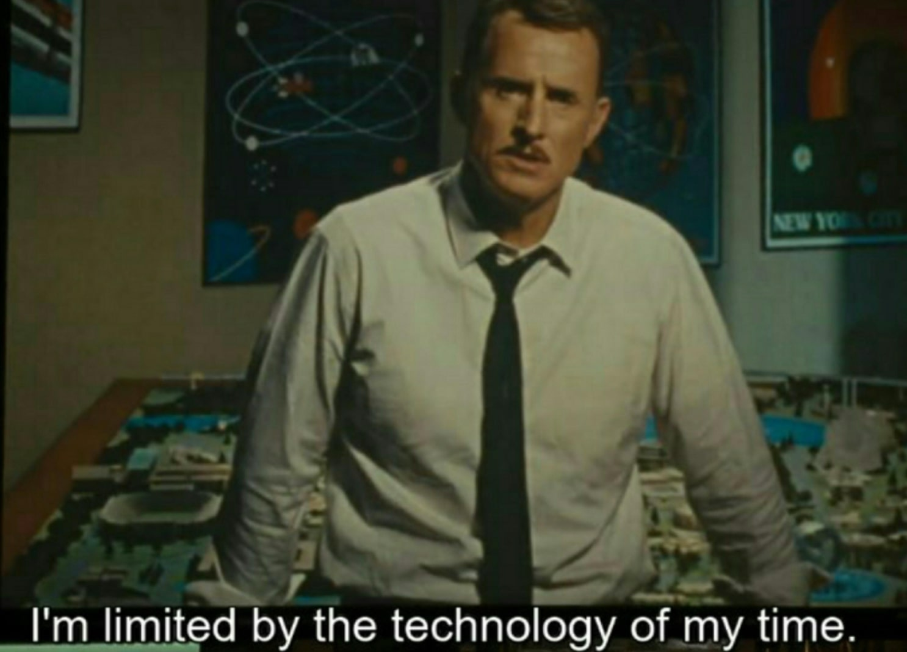

obligatory neofetch: 
 

 
To make a standard win10 vm using KVM but without gpu passthrough, follow this: 
 
https://www.makeuseof.com/create-windows-virtual-machine-in-linux-with-kvm/ 
 
https://access.redhat.com/documentation/en-us/red_hat_virtualization/4.4/html/virtual_machine_management_guide/installing_guest_agents_and_drivers_windows 

https://aur.archlinux.org/packages/virtio-win 
  
now that we have a vm for work, this is where the fun begins: 
 
https://wiki.archlinux.org/title/PCI_passthrough_via_OVMF#Prerequisites
   
kvm is amazing and using it I plan on making the ultimate linux setup in which I can develop programs, play games at near-native performance, and do all other computer stuff. 
the base layer will be Manjaro because it's based on Arch and all Arch packages work on it and the AUR is awesome, and the Windows layer will be a Windows 10 Pro VM with GPU Passthrough so I can play all my games without worrying about compatibility, easy-anticheat, drms, and all the other hoops you have to jump through to game on linux. 
   
UPDATE 
   

  
Update 2: you also need an additional monitor because the passthrough vm doesnt show on the primary monitor unless you're using a spice server which has a large performance overhead so why even bother becuase the entire point of this system is supposed to be close-to-native performance on virtual hardware. sighhhhhh 
  
(just in case)
https://github.com/mysteryx93/GPU-Passthrough-with-Optimus-Manager-Guide
  
Update 3: WE'RE COOKING 
  
 
 
  
https://gist.github.com/firelightning13/e530aec3e3a4e15885a10f6c4b7ae021?permalink_comment_id=4736891#setting-up-windows-1011-vm  
  
Looking Glass is a nice tool which on the surface seems to solve my single-monitor woes. have to dig more though  
  
UPDATE 4: Code 43 error, apparently updating to the latest drivers should fix it because older drivers ban the gpu from being used in a vm because nvidia was evil back then ig
  

  
Update 5: I keep getting the accursed Code 43 error even after updating my drivers which could mean a million different things and honestly I know what I must do (trying the hundreds of fixes posted online individually in the hope that one of them works) but I don't know if I have the strength to do it.
 
https://www.reddit.com/r/VFIO/comments/pqk9td/comment/hddgpup/?utm_source=share&utm_medium=web2x&context=3 

 UPDATE 6: WE'RE SO FUCKING BACK 

  

UPDATE 7: code 43 mere hatho mare ga, it's back and looking glass is not working becuase the gpu is not working and I am THIS close to uninstalling everything and going to back to my nice WORKING dual boot setup.
  
  

we're in the gravy now, but im NOT willing to brick my gpu following my neckbeard fantasies. I'll try to find a way to make this work without flashing a different vbios, especially because theres no official one available for my specific version of the 1050. 

UPDATE 8: mission failed, that's all the time I had this weekend, maybe I'll have another crack at this when I've recovered from reading Arch manpages for 24 hours straight. 

Update 9: I was doing a bit of reading and the code 43 error might have been caused by something related to by gpu (probably) being MUXED Optimus. On MUXless Optimus setups the dgpu is connected to the igpu which is then fed to the laptop monitor and display port. MUXED Optimus configurations have the dgpu and igpu connected to a multiplexer, which is connected to the panel and display out. apparently theres different types of guides for MUXLESS and MUXED, so maybe I followed the wrong type of guide and there's hope after all. 
  

Been a long time. PTSD is so real with this one: https://youtu.be/1iRn-g1m4QE?si=b3pl0KvtcID8rF7E  

